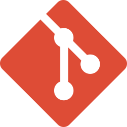
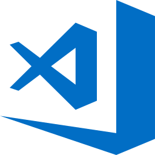

# 👋 Hi there, I'm Sathananthan

#### Backend Web Developer (Python + Django)

---

- 👨‍💼 I’m currently working in Tecnospice technologies pvt. ltd.
- 👯 I’m looking to collaborate with friends (developers)
- 🤔 I’m thinking and practicing about how to write clean code
- 📫 Reach me via: sathananthanit15@gmail.com
- 😄 Pronouns: Zatha, Zass
- ⚡ Fun fact: I like to watch movies. But mostly watch tech conferences in Youtube

### Languages and Tools

          

